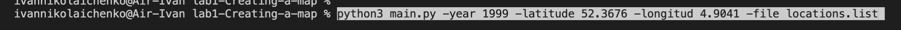
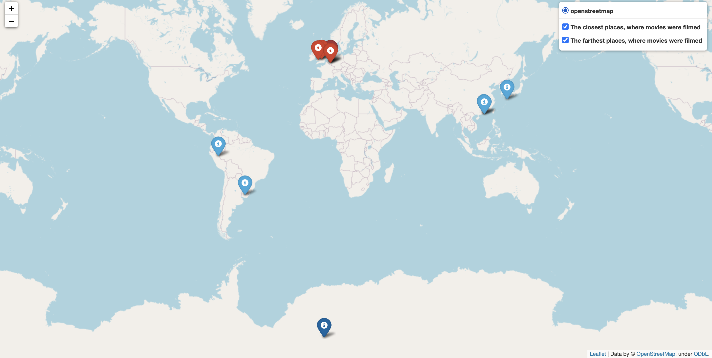
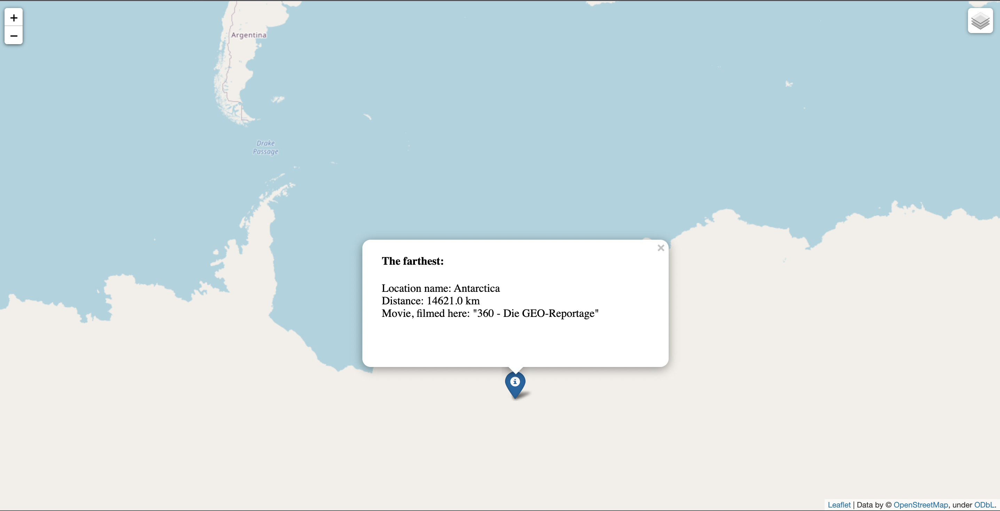

##Створення веб-карти з локаціями зйомки фільмів
Цей модуль призначено для створення карти на основі ваших координат та обранного року. 
Під час роботи були використані такі бібліотеки як:
-folium
-math
-geopy
-argparse

Створенна карта місить основний шар, два шари міток. Шар з шістьма найближчими місцями, де знімали фільми (вони червоні) та з шістьма найдальшими (вони сині). Найблища та найдальша локації виділені трошки відмінними кольорами. При натисканні на мітку показується інформація щодо цього місця. Керувати шарами можна через віконечко в правому верхньому куту. Шари можна вмикати та вимикати.

Для початку роботи з модулем треба завантажити файл locations.list, що  містить близько 5000 різних локацій, та в прописати наступне:

А саме: -потрібний рік; -широту; -довготу; -шлях до файлу;
Після виконання, яке може зайняти 1хв, готовий файл з картою зберігається в поточній директорії.

